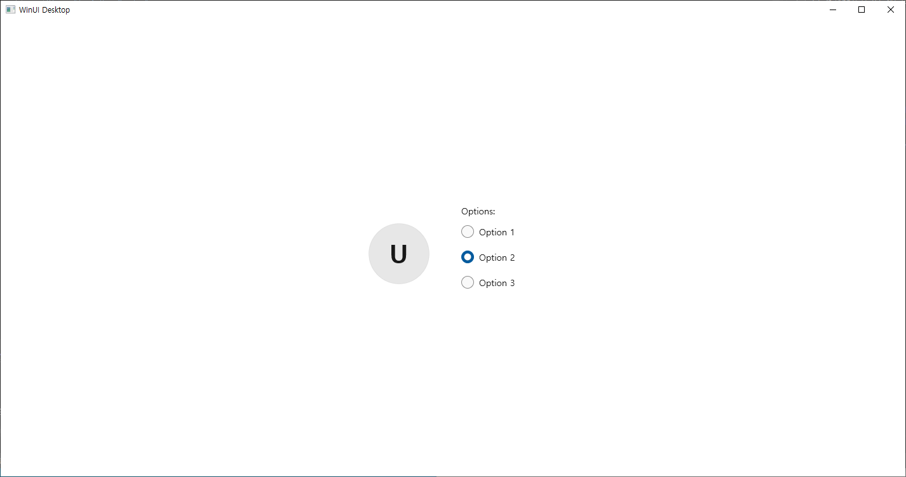
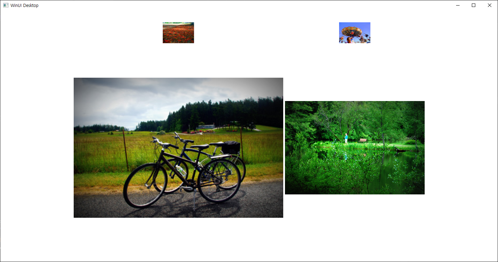
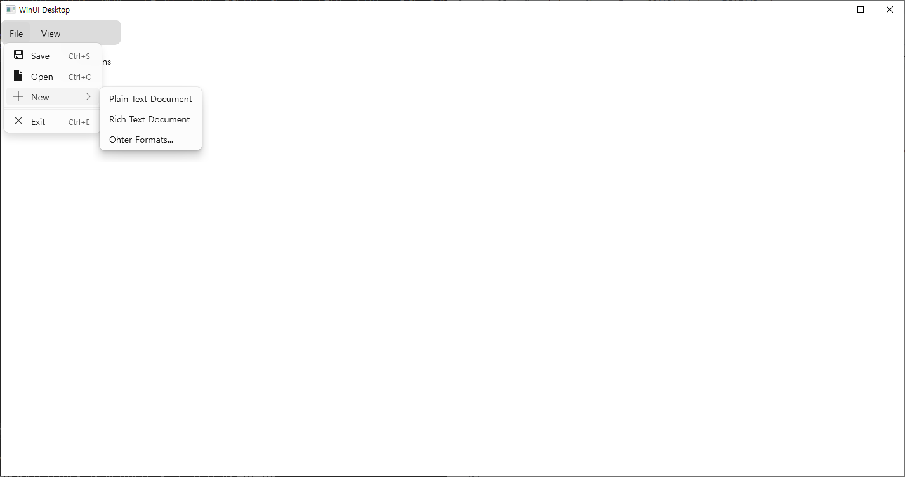
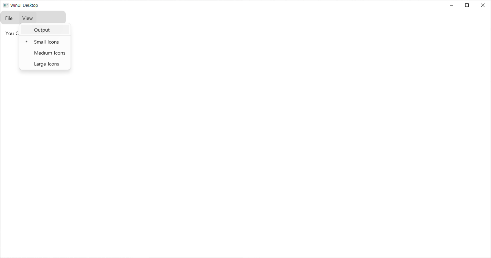

# 231121 비주얼프로그래밍 과제
20191276 컴퓨터공학과 양용석

1. 5장 라디오 버튼 활용 프로필 선택
코드
```
//MainWindow.xaml.cpp
#include "pch.h"
#include "MainWindow.xaml.h"
#if __has_include("MainWindow.g.cpp")
#include "MainWindow.g.cpp"
#endif
#include <microsoft.ui.xaml.window.h>
#include "winrt/Microsoft.UI.Xaml.Media.Imaging.h"
using namespace Microsoft::UI::Xaml::Media::Imaging;
using namespace Microsoft::UI::Xaml::Controls;
using namespace winrt;
using namespace std;
using namespace Windows::Foundation;
using namespace Microsoft::UI::Xaml;

// To learn more about WinUI, the WinUI project structure,
// and more about our project templates, see: http://aka.ms/winui-project-info.

namespace winrt::App1::implementation
{  
    int32_t MainWindow::MyProperty()    {        
        throw hresult_not_implemented();
    }
    void MainWindow::MyProperty(int32_t /* value */)  {
        InitializeComponent();
        auto wn{ this->try_as<::IWindowNative>() };
        HWND hWnd{ 0 };
        wn->get_WindowHandle(&hWnd);
        SetWindowPos(hWnd, NULL, 600, 200, 320, 320, NULL);
        this->Title(L"Image");
        throw hresult_not_implemented();
    }
}
void winrt::App1::implementation::MainWindow::RadioButton_Checked(winrt::Windows::Foundation::IInspectable const& sender, winrt::Microsoft::UI::Xaml::RoutedEventArgs const& e)
{
    BitmapImage bimg;
    Uri uri = Uri(L"D:\\lena.jpg");
    bimg.UriSource(uri);
    pp().ProfilePicture(bimg);
}
void winrt::App1::implementation::MainWindow::RadioButton_Checked_1(winrt::Windows::Foundation::IInspectable const& sender, winrt::Microsoft::UI::Xaml::RoutedEventArgs const& e)
{
    pp().ProfilePicture(NULL);
    pp().Initials(L"");
    pp().DisplayName(L"UmjunSik");
}
void winrt::App1::implementation::MainWindow::RadioButton_Checked_2(winrt::Windows::Foundation::IInspectable const& sender, winrt::Microsoft::UI::Xaml::RoutedEventArgs const& e)
{
    pp().ProfilePicture(NULL);
    pp().Initials(L"FY");  
}

```

```
//MainWindow.xaml
<Window
    x:Class="App1.MainWindow"
    xmlns="http://schemas.microsoft.com/winfx/2006/xaml/presentation"
    xmlns:x="http://schemas.microsoft.com/winfx/2006/xaml"
    xmlns:local="using:App1"
    xmlns:d="http://schemas.microsoft.com/expression/blend/2008"
    xmlns:mc="http://schemas.openxmlformats.org/markup-compatibility/2006"
    mc:Ignorable="d">

    <StackPanel Orientation="Horizontal" HorizontalAlignment="Center" VerticalAlignment="Center">
        <PersonPicture x:Name="pp" Height="300"
                       Margin="0, 30, 50, 0"
                       VerticalAlignment="Top"
                       Initials="AA"/>
        <RadioButtons Header="Options:">
            <RadioButton Content="Option 1" Checked="RadioButton_Checked"/>
            <RadioButton Content="Option 2" Checked="RadioButton_Checked_1"/>
            <RadioButton Content="Option 3" Checked="RadioButton_Checked_2"/>
        </RadioButtons>
    </StackPanel>
</Window>
```

실행화면</br>
</br>
</br>
</br>

2. 6-3 이미지 콜라주</br>
코드
```
//MainWindow.xaml
<Window
    x:Class="App2.MainWindow"
    xmlns="http://schemas.microsoft.com/winfx/2006/xaml/presentation"
    xmlns:x="http://schemas.microsoft.com/winfx/2006/xaml"
    xmlns:local="using:App2"
    xmlns:d="http://schemas.microsoft.com/expression/blend/2008"
    xmlns:mc="http://schemas.openxmlformats.org/markup-compatibility/2006"
    mc:Ignorable="d">


    <Grid ColumnSpacing="5" RowSpacing="5" HorizontalAlignment="Center" VerticalAlignment="Center">
        <Grid.RowDefinitions>
            <RowDefinition Height="60"/>
            <RowDefinition Height="590"/>
        </Grid.RowDefinitions>

        <Grid.ColumnDefinitions>
            <ColumnDefinition Width="600"/>
            <ColumnDefinition Width="400" />
        </Grid.ColumnDefinitions>

        <Image Grid.Column="0" Grid.Row="0">
            <Image.Source>
                <BitmapImage UriSource="https://github.com/microsoft/WinUI-Gallery/blob/main/WinUIGallery/Assets/SampleMedia/LandscapeImage1.jpg?raw=ture"/>
            </Image.Source>
        </Image>
        <Image Grid.Column="1" Grid.Row="0">
            <Image.Source>
                <BitmapImage UriSource="https://github.com/microsoft/WinUI-Gallery/blob/main/WinUIGallery/Assets/SampleMedia/LandscapeImage2.jpg?raw=ture"/>
            </Image.Source>
        </Image>
        <Image Grid.Column="0" Grid.Row="1">
            <Image.Source>
                <BitmapImage UriSource="https://github.com/microsoft/WinUI-Gallery/blob/main/WinUIGallery/Assets/SampleMedia/LandscapeImage3.jpg?raw=ture"/>
            </Image.Source>
        </Image>
        <Image Grid.Column="1" Grid.Row="1">
            <Image.Source>
                <BitmapImage UriSource="https://github.com/microsoft/WinUI-Gallery/blob/main/WinUIGallery/Assets/SampleMedia/LandscapeImage4.jpg?raw=ture"/>
            </Image.Source>
        </Image>
    </Grid>
</Window>
```
실행화면
</br>


3. 메뉴 바</br>

코드
```
//MainWindow.xaml
 <Grid>
     <Grid.RowDefinitions>
         <RowDefinition Height="40"/>
         <RowDefinition Height="60"/>
     </Grid.RowDefinitions>
     <Grid.ColumnDefinitions>
         <ColumnDefinition Width="Auto"/>
     </Grid.ColumnDefinitions>
     <Grid Grid.Row="0" Background="Gainsboro" CornerRadius="10">
         <MenuBar>
             <MenuBarItem Title="File">
                 <MenuFlyoutItem Text="Save" Click="MenuFlyoutItem_Click" Icon="Save">
                     <MenuFlyoutItem.KeyboardAccelerators>
                         <KeyboardAccelerator Modifiers="Control" Key="S"/>
                     </MenuFlyoutItem.KeyboardAccelerators>
                 </MenuFlyoutItem>
                 <MenuFlyoutItem Text="Open" Click="MenuFlyoutItem_Click_1" Icon="Page">
                 <MenuFlyoutItem.KeyboardAccelerators>
                     <KeyboardAccelerator Modifiers="Control" Key="O"/>
                 </MenuFlyoutItem.KeyboardAccelerators>
                 </MenuFlyoutItem>
                 <MenuFlyoutSubItem Text="New" Icon="Add">
                     <MenuFlyoutItem Text="Plain Text Document"/>
                     <MenuFlyoutItem Text="Rich Text Document"/>
                     <MenuFlyoutItem Text="Ohter Formats..."/>
                 </MenuFlyoutSubItem>
                 <MenuFlyoutSeparator/>

                 <MenuFlyoutSeparator/>
                 <MenuFlyoutItem Text="Exit" Click="MenuFlyoutItem_Click_3" Icon="Cancel">
                     <MenuFlyoutItem.KeyboardAccelerators>
                         <KeyboardAccelerator Modifiers="Control" Key="E"/>
                     </MenuFlyoutItem.KeyboardAccelerators>
                 </MenuFlyoutItem>
             </MenuBarItem>

             <MenuBarItem Title="View">
                 <MenuFlyoutItem Text="Output" Click="MenuFlyoutItem_Click_4"/>
                 <MenuFlyoutSeparator/>
                 <RadioMenuFlyoutItem Text="Small Icons" GroupName="SizeGroup"
                                          Click="RadioMenuFlyoutItem_Click"/>
                 <RadioMenuFlyoutItem Text="Medium Icons" GroupName="SizeGroup"
                      Click="RadioMenuFlyoutItem_Click_1"/>
                 <RadioMenuFlyoutItem Text="Large Icons" GroupName="SizeGroup"
                      Click="RadioMenuFlyoutItem_Click_2"/>
             </MenuBarItem>


         </MenuBar>
     </Grid>
     <Grid Grid.Row="1" Padding="15">
         <TextBlock x:Name="TBlock">You Clicked :</TextBlock>
     </Grid>
 </Grid>
```

```
//MainWindow.xaml.cpp 일부

void winrt::App4::implementation::MainWindow::MenuFlyoutItem_Click(winrt::Windows::Foundation::IInspectable const& sender, winrt::Microsoft::UI::Xaml::RoutedEventArgs const& e)
{
    TBlock().Text(L"You Clicked : Save");
}


void winrt::App4::implementation::MainWindow::MenuFlyoutItem_Click_1(winrt::Windows::Foundation::IInspectable const& sender, winrt::Microsoft::UI::Xaml::RoutedEventArgs const& e)
{
    TBlock().Text(L"You Clicked : Open");
}


void winrt::App4::implementation::MainWindow::MenuFlyoutItem_Click_3(winrt::Windows::Foundation::IInspectable const& sender, winrt::Microsoft::UI::Xaml::RoutedEventArgs const& e)
{
    TBlock().Text(L"You Clicked : Exit");
}


void winrt::App4::implementation::MainWindow::MenuFlyoutItem_Click_4(winrt::Windows::Foundation::IInspectable const& sender, winrt::Microsoft::UI::Xaml::RoutedEventArgs const& e)
{
    TBlock().Text(L"You Clicked : Output");
}


void winrt::App4::implementation::MainWindow::RadioMenuFlyoutItem_Click(winrt::Windows::Foundation::IInspectable const& sender, winrt::Microsoft::UI::Xaml::RoutedEventArgs const& e)
{
    TBlock().Text(L"You Clicked : Small icons");
}


void winrt::App4::implementation::MainWindow::RadioMenuFlyoutItem_Click_1(winrt::Windows::Foundation::IInspectable const& sender, winrt::Microsoft::UI::Xaml::RoutedEventArgs const& e)
{
    TBlock().Text(L"You Clicked : Medium icons");
}


void winrt::App4::implementation::MainWindow::RadioMenuFlyoutItem_Click_2(winrt::Windows::Foundation::IInspectable const& sender, winrt::Microsoft::UI::Xaml::RoutedEventArgs const& e)
{
    TBlock().Text(L"You Clicked : Large icons");
}

```
실행 화면</br>
</br>
</br>


3. 8장 키워드 기반 메모장

   코드
   
