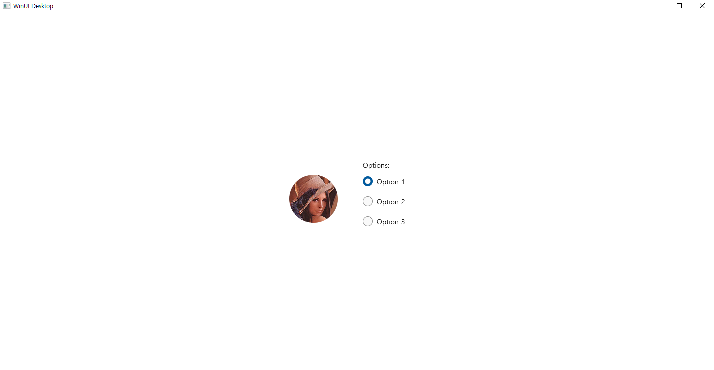

# 231121 비주얼프로그래밍 과제
20191276 컴퓨터공학과 양용석

1. 5장 라디오 버튼 활용 프로필 선택
코드
```
//MainWindow.xaml.cpp
#include "pch.h"
#include "MainWindow.xaml.h"
#if __has_include("MainWindow.g.cpp")
#include "MainWindow.g.cpp"
#endif
#include <microsoft.ui.xaml.window.h>
#include "winrt/Microsoft.UI.Xaml.Media.Imaging.h"
using namespace Microsoft::UI::Xaml::Media::Imaging;
using namespace Microsoft::UI::Xaml::Controls;
using namespace winrt;
using namespace std;
using namespace Windows::Foundation;
using namespace Microsoft::UI::Xaml;

// To learn more about WinUI, the WinUI project structure,
// and more about our project templates, see: http://aka.ms/winui-project-info.

namespace winrt::App1::implementation
{  
    int32_t MainWindow::MyProperty()    {        
        throw hresult_not_implemented();
    }
    void MainWindow::MyProperty(int32_t /* value */)  {
        InitializeComponent();
        auto wn{ this->try_as<::IWindowNative>() };
        HWND hWnd{ 0 };
        wn->get_WindowHandle(&hWnd);
        SetWindowPos(hWnd, NULL, 600, 200, 320, 320, NULL);
        this->Title(L"Image");
        throw hresult_not_implemented();
    }
}
void winrt::App1::implementation::MainWindow::RadioButton_Checked(winrt::Windows::Foundation::IInspectable const& sender, winrt::Microsoft::UI::Xaml::RoutedEventArgs const& e)
{
    BitmapImage bimg;
    Uri uri = Uri(L"D:\\lena.jpg");
    bimg.UriSource(uri);
    pp().ProfilePicture(bimg);
}
void winrt::App1::implementation::MainWindow::RadioButton_Checked_1(winrt::Windows::Foundation::IInspectable const& sender, winrt::Microsoft::UI::Xaml::RoutedEventArgs const& e)
{
    pp().ProfilePicture(NULL);
    pp().Initials(L"");
    pp().DisplayName(L"UmjunSik");
}
void winrt::App1::implementation::MainWindow::RadioButton_Checked_2(winrt::Windows::Foundation::IInspectable const& sender, winrt::Microsoft::UI::Xaml::RoutedEventArgs const& e)
{
    pp().ProfilePicture(NULL);
    pp().Initials(L"FY");  
}

```

```
//MainWindow.xaml
<Window
    x:Class="App1.MainWindow"
    xmlns="http://schemas.microsoft.com/winfx/2006/xaml/presentation"
    xmlns:x="http://schemas.microsoft.com/winfx/2006/xaml"
    xmlns:local="using:App1"
    xmlns:d="http://schemas.microsoft.com/expression/blend/2008"
    xmlns:mc="http://schemas.openxmlformats.org/markup-compatibility/2006"
    mc:Ignorable="d">

    <StackPanel Orientation="Horizontal" HorizontalAlignment="Center" VerticalAlignment="Center">
        <PersonPicture x:Name="pp" Height="300"
                       Margin="0, 30, 50, 0"
                       VerticalAlignment="Top"
                       Initials="AA"/>
        <RadioButtons Header="Options:">
            <RadioButton Content="Option 1" Checked="RadioButton_Checked"/>
            <RadioButton Content="Option 2" Checked="RadioButton_Checked_1"/>
            <RadioButton Content="Option 3" Checked="RadioButton_Checked_2"/>
        </RadioButtons>
    </StackPanel>
</Window>
```

실행화면</br>
</br>
</br>
</br>

2. 이미지 콜라주</br>

